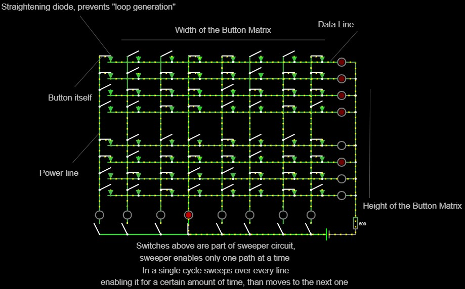

# Button Matrix Circuit

Live circuit simulation can be viewed [here] (https://www.falstad.com/circuit/). 
To load live circuit go to mentioned circuit simulator, chose `File` -> `Open File...` and open [button_matrix_circuit.txt](button_matrix_circuit.txt)

# My resistors

| id |  ohm  |
|:--:|:-----:|
| 1  |  10   |
| 2  |  51   |
| 3  |  100  |
| 4  |  300  |
| 5  |  510  |
| 6  |  750  |
| 7  |  1k   |
| 8  |  2 k  |
| 9  | 3.3k  |
| 10 |  5k   |
| 11 | 5.6 k |
| 12 | 7.5 k |
| 13 |  10k  |
| 14 | 30 k  |
| 15 |  39k  |
| 16 |  47k  |